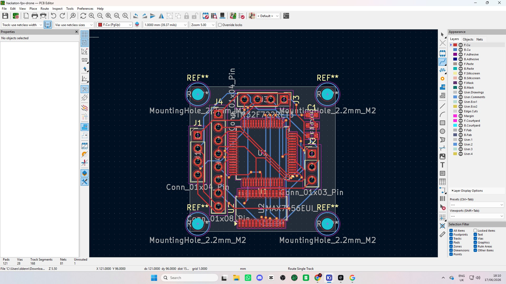
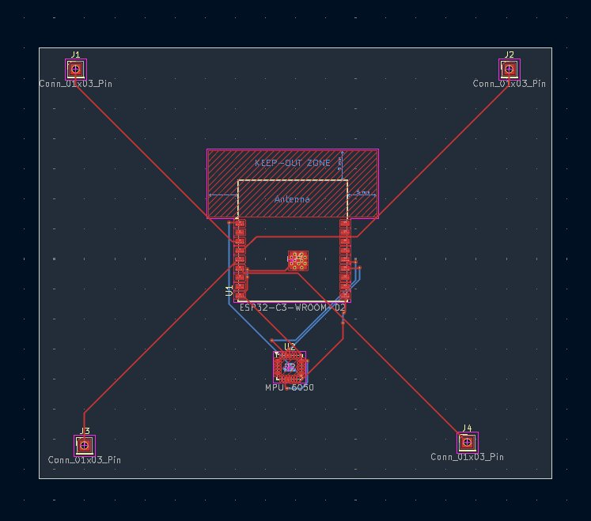
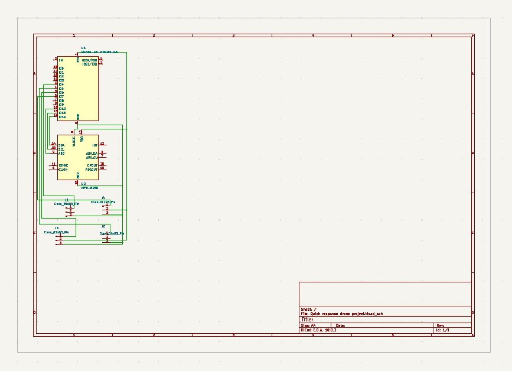
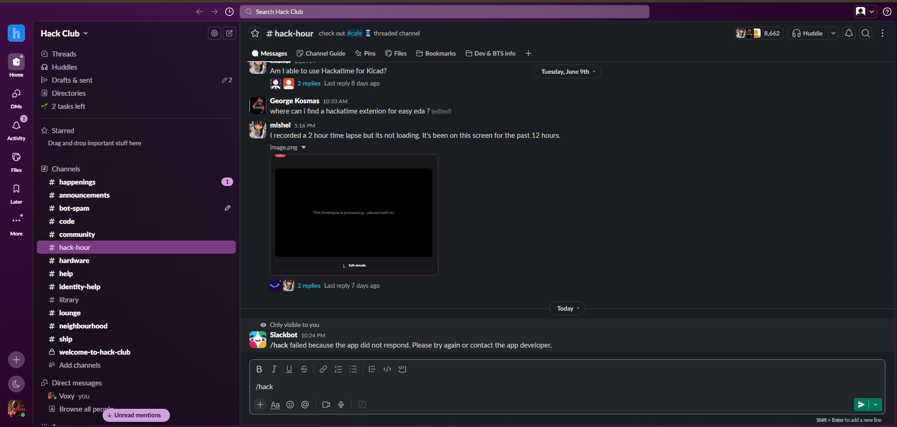

# 🚁 Custom FPV Acro Drone Build

> A fully custom FPV acro drone featuring a hand-designed PCB, 3D-printed frame, and from-scratch hardware design — built for the [Hack Club Stardance](https://hackclub.com/) grant program.

---

## 📖 Project Overview

This project is a custom-built FPV (First Person View) acro drone, designed entirely from scratch by a team of two. The build covers everything from PCB design in KiCad to 3D-printed frame components modelled in OnShape. Rather than buying an off-the-shelf flight controller, we designed our own — a custom PCB centred around the **STM32F722** microcontroller paired with a **MAX7456** OSD chip and an **MPU-6050** IMU, giving us full control over the hardware stack.

The project went through two major PCB revisions and a complete rethink of the drone type mid-development, making this a genuine engineering challenge from start to finish.

---

## 👥 Team

| Name | Role |
|------|------|
| Me (Author) | PCB design, schematic, component layout, routing |
| Best Friend | 3D frame design (STL files, OnShape) |

---

## ⏱️ Time Log

> **Note on time tracking:** Hackatime couldn't be used as the `/hack` Slack command failed to respond (see screenshot below). Time was tracked manually as accurately and honestly as possible.

| Task | Person | Hours | Notes |
|------|--------|-------|-------|
| Learning KiCad (PCB software) | Me | 2.5 hrs | First time using KiCad — learning footprints, schematic editor, PCB layout tools |
| PCB Version 1 — Design & Layout | Me | 4.5 hrs | Designed for a different drone type; pivoted to acro drone after completion |
| PCB Version 2 — Redesign & Routing | Me | 5.0 hrs | Full redesign for acro drone; unfamiliar territory, significant routing challenges |
| 3D Frame Design (STL) | Best Friend | 8.0 hrs | OnShape was familiar but getting drone dimensions accurate was far more difficult than expected |
| **Total** | | **20.0 hrs** | |

---

## 🔧 Hardware Design

### PCB — Custom Flight Controller

The PCB was designed in **KiCad** and went through two full revisions.

#### Key Components
- **STM32F722** — Main flight controller MCU
- **MPU-6050** — 6-axis IMU (gyroscope + accelerometer) for flight stabilisation
- **MAX7456** — OSD (On-Screen Display) chip for FPV video overlay
- **ESP32-C3-WROOM-02** — Wi-Fi/Bluetooth module (V1 design)
- Connectors: `Conn_01x04_Pin`, `Conn_01x08_Pin`, `Conn_01x03_Pin`
- 4× M2.2mm mounting holes for frame attachment

#### PCB Revision History

**Version 1**
- Designed around the ESP32-C3-WROOM-02 as the main module
- Intended for a different drone form factor
- After completing this version, we made the decision to pivot to a proper acro drone build
- Features keep-out zone for the ESP32 antenna

**Version 2 (Current)**
- Full redesign around the STM32F722 for proper acro flight controller functionality
- Integrated MPU-6050 IMU for accurate flight data
- Added MAX7456 OSD chip
- 121 pads, 28 vias, 168 track segments across 81 nets
- 1 unrouted connection remaining at time of documentation

#### PCB Stats (V2 Final)
```
Pads:           121
Vias:            28
Track Segments: 168
Nets:            81
Unrouted:         1
```

### 3D Frame — Custom STL Design

The drone frame was designed by my best friend using **OnShape**. Despite being familiar with OnShape as a tool, designing a drone frame proved significantly more challenging than expected — getting the dimensions accurate for motor mounting, prop clearance, and PCB fitment required many iterations over 8 hours of focused work.

---

## 🗂️ Project Structure

```
custom-fpv-drone/
├── README.md
├── pcb/
│   ├── hackaton-fpv-drone.kicad_pcb     # KiCad PCB file (V2)
│   ├── hackaton-fpv-drone.kicad_sch     # Schematic
│   └── ...
├── stl/
│   └── drone-frame.stl                  # 3D printed frame (OnShape export)
└── images/
    ├── pcb-v2-layout.png                # Final PCB layout in KiCad
    ├── pcb-v1-layout.png                # V1 PCB layout
    ├── pcb-v1-schematic.png             # V1 schematic view
    ├── pcb-v1-3d.png                    # V1 component placement
    └── hacktime-issue.png               # Evidence of Hackatime tracking issue
```

---

## 🖼️ Screenshots & Evidence

### Final PCB (V2) — KiCad PCB Editor
The completed V2 PCB layout showing the STM32F722 at the centre, surrounding connectors, IMU placement, and OSD chip. The board features 4 mounting holes and organised track routing across front and back copper layers.



### Version 1 PCB — ESP32-C3 Based Design
The original PCB design built around the ESP32-C3-WROOM-02 module, including the required keep-out zone for the antenna. This was designed for a different drone form factor before the pivot to acro.



### Schematic (V1)
The KiCad schematic showing the ESP32-C3 connected to the MPU-6050 IMU, connectors, and supporting passives.



### Hackatime Issue — Evidence
Screenshot showing the `/hack` Slack command failing with the error: *"the app did not respond"*. This is why time was logged manually.



---

## 🛠️ Tools Used

| Tool | Purpose |
|------|---------|
| KiCad 8.x | PCB schematic and layout design |
| OnShape | 3D frame modelling and STL export |
| Hack Club Slack | Team communication and project logging |
| Hackatime | Attempted time tracking (see issues above) |

---

## 🚧 Current Status & Next Steps

- [x] PCB V1 designed and completed
- [x] Pivoted to acro drone form factor
- [x] PCB V2 schematic completed
- [x] PCB V2 layout completed (1 unrouted net remaining)
- [x] 3D frame STL designed
- [ ] Complete final PCB routing (1 net)
- [ ] Order PCB from manufacturer
- [ ] Print frame STL
- [ ] Source and assemble components
- [ ] Flash firmware and test

---

## 💡 Reflections

This project pushed both of us well outside our comfort zones. Learning KiCad from scratch, pivoting mid-project when we decided acro was the right form factor, and wrestling with dimension constraints in OnShape were all genuine challenges. Hackatime didn't cooperate, but we tracked our time as honestly as we could and have screenshot evidence of the tooling failure.

The 20 hours logged represents real, focused engineering work — not just sitting in front of a screen.
